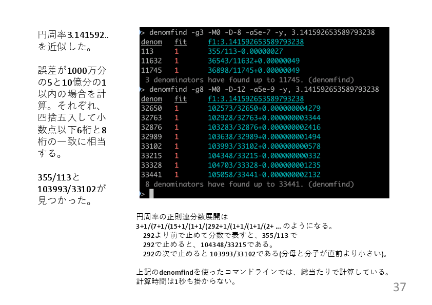

「分母逆算器」であるコマンドラインプログラムdenomfindおよび関連コマンドラインプログラムをこのレポジトリは提供する。

いろいろな報告書やデータや論文を読んでいると、割合の数値がいくつか間違っていたり、でたらめなこともあり、なかなか数値記載ミスが全く無いことは、あまり多くは無いかも知れない。
この問題の対処のために、その割合の近似値がいくつかあれば、逆算して母数のサイズの候補を網羅的に求める機能などを持ったプログラムを作った。

単純な例としては0.143という数が１つあれば、1/7に近いから7という数を復元する。7の倍数も逐次出力するし、7だけ出力する選択も用意している。分母が7の倍数の場合だけでなく、32/223=0.14398.. などの候補も出す。0.50と0.33などのように複数の割合に対しても計算をする。この場合は6の倍数の分母の場合が出てくるし、40や46や52など、0.50や0.33を近似値として分数に持つ共通な分母を持つ場合を出力する。それらを思いついたいくつかの表示方法で分かりやすく表示する。

世の中には四捨五入や切り捨てや切り上げの他に、偶数丸め(銀行で使うらしい)や奇数丸めがある。他には0.2345→0.235→0.24のような四捨五入を2回してしまったことによるずれもある。いろいろな近似の仕方に対応するための機能を実装している。さらには、分母が同じである割合の数値が部分的に間違っていた場合にそれを訂正できるように、間違いの許容個数を指定して、分母の値を探索できるようにした機能も実装している。

下野寿之 bin4tsv@gmail.com

