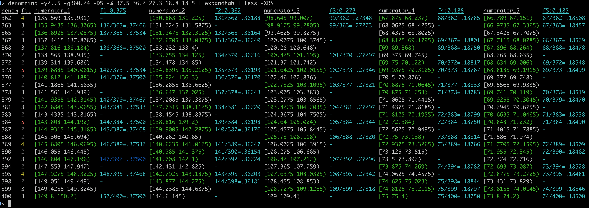

37.5% 36.2% 27.3% 18.8% 18.5%の5個の割合の数に対して、これらが四捨五入されたものと見なして、共通する分母の探索を試みたいとする。

出力される表の各列の意味は下記の通り: 
- __1列目__(最も左の列):分母(の候補)である。　
- __2列目__(赤や黄色や白や暗い白の4段階) : 候補の分母に対して、分子が整数になりうるものが(5個中)何個存在したかを示す。最大(の5)の場合は赤、その次(4)の場合は黄色、その次(3)の値の場合は白、それより小さい数は、暗い白とした。

